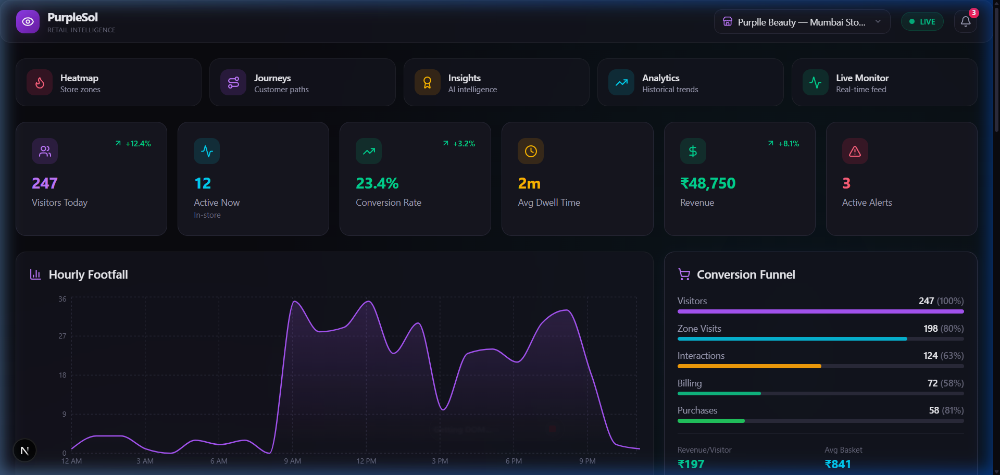
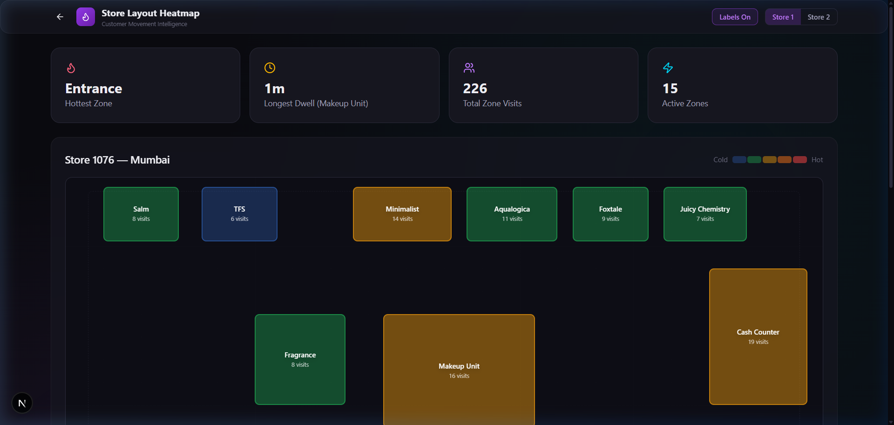
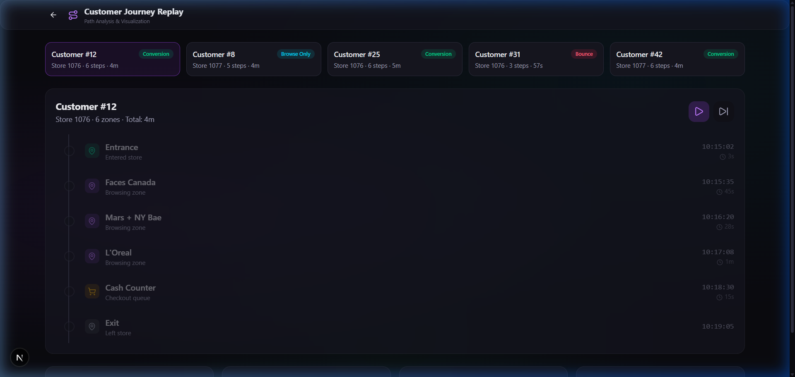
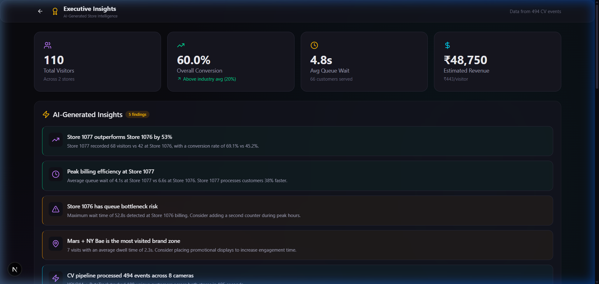
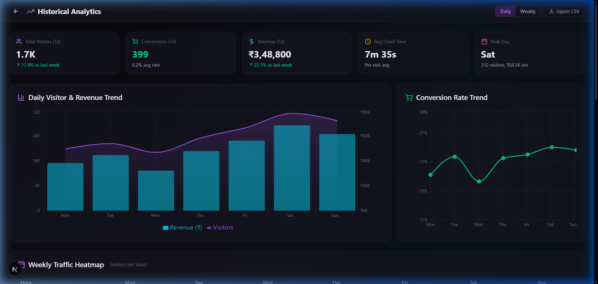
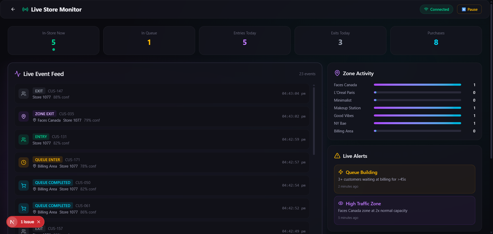
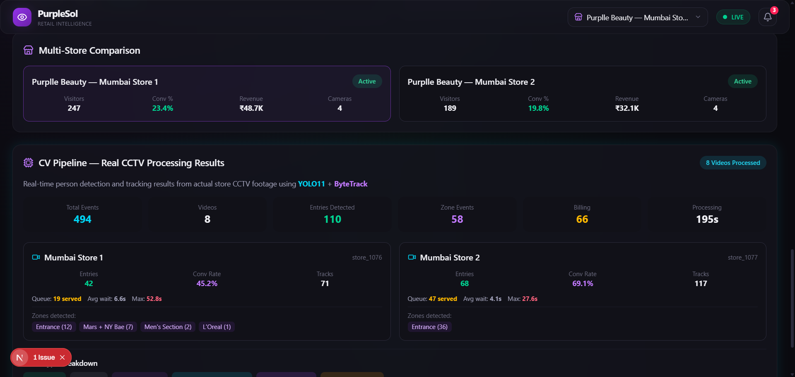

# PurpleSol — AI Retail Intelligence Platform

> **Google Analytics for Physical Retail Stores**

Transform existing CCTV cameras into a real-time retail analytics engine — no new hardware, no facial recognition, just AI-powered business intelligence.


---

## 📸 Screenshots

| Executive Dashboard | Store Heatmap | Customer Journeys |
|:---:|:---:|:---:|
|  |  |  |

| AI Insights | Historical Analytics | Live Monitor |
|:---:|:---:|:---:|
|  |  |  |

| CV Pipeline — Real CCTV Results |
|:---:|
|  |

---

## 🎯 Problem Statement

Retailers invest millions in CCTV infrastructure but use it **only for security playback**. Meanwhile, they have zero visibility into pre-purchase customer behavior:

- Which zones attract the most foot traffic?
- Where do customers spend the most time (dwell)?
- What paths lead to purchases vs. bounce?
- How long are customers waiting in queues?
- Which store layout performs better?

**E-commerce has Google Analytics. Physical retail has... nothing. Until PurpleSol.**

---

## 💡 Solution

PurpleSol processes existing CCTV footage through a computer vision pipeline to generate **business events** — then presents them in a SaaS-quality analytics dashboard.

### Core Capabilities

| Feature | Description |
|---------|-------------|
| 🚶 **Footfall Analytics** | Hourly visitor counts, peak detection, daily/weekly trends |
| 🗺️ **Zone Intelligence** | Brand-wise heatmap, dwell time per zone, popularity rankings |
| 🛤️ **Customer Journeys** | Full path reconstruction: Entry → Zone visits → Billing → Exit |
| 📊 **Conversion Funnel** | Visitor → Zone → Interaction → Billing → Purchase pipeline |
| ⏱️ **Queue Analytics** | Real-time wait times, throughput, abandonment rates |
| ⚠️ **Anomaly Detection** | Auto-alerts for long queues, traffic drops, unusual patterns |
| 💰 **POS Correlation** | Link in-store behavior to actual purchase transactions |
| 🏬 **Multi-Store** | Cross-store benchmarking and performance comparison |
| 📈 **Historical Trends** | Weekly traffic heatmap, zone sparklines, conversion trends |
| 📡 **Live Monitoring** | Real-time event feed with WebSocket broadcasting |

---

## 🏗️ System Architecture

```
┌─────────────────────────────────────────────────────────────────┐
│                        VIDEO SOURCES                            │
│              CCTV Streams / Uploaded Video Files                 │
└──────────────────────────┬──────────────────────────────────────┘
                           ↓
┌─────────────────────────────────────────────────────────────────┐
│                    CV PROCESSING PIPELINE                       │
│  ┌──────────────┐  ┌──────────────┐  ┌───────────────────────┐ │
│  │  YOLO11      │→ │  ByteTrack   │→ │  Zone Mapper          │ │
│  │  Detection   │  │  Tracking    │  │  (Point-in-Polygon)   │ │
│  │  ─────────── │  │  ─────────── │  │  ──────────────────── │ │
│  │  Person bbox │  │  Persistent  │  │  Classify position    │ │
│  │  @0.4 conf   │  │  track IDs   │  │  into store zones     │ │
│  └──────────────┘  └──────────────┘  └───────────────────────┘ │
└──────────────────────────┬──────────────────────────────────────┘
                           ↓
┌─────────────────────────────────────────────────────────────────┐
│                      EVENT ENGINE                               │
│  Detection → Business Event conversion                          │
│  Events: ENTRY, EXIT, ZONE_ENTER, ZONE_EXIT,                   │
│          QUEUE_ENTER, QUEUE_COMPLETED                           │
└──────────┬──────────────────────────────────┬───────────────────┘
           ↓                                  ↓
┌────────────────────┐            ┌───────────────────────┐
│   PostgreSQL       │            │   WebSocket Layer     │
│   (Neon / SQLite)  │            │   Real-time pub/sub   │
│   ────────────     │            │   ────────────────    │
│   Events, Journeys │            │   Global + per-store  │
│   POS, Anomalies   │            │   broadcasting        │
└────────┬───────────┘            └───────────┬───────────┘
         ↓                                    ↓
┌─────────────────────────────────────────────────────────────────┐
│                     FASTAPI BACKEND                             │
│  ┌────────────┐ ┌──────────────┐ ┌────────────┐ ┌───────────┐ │
│  │ Store      │ │ Analytics    │ │ Journey    │ │ Anomaly   │ │
│  │ Service    │ │ Service      │ │ Service    │ │ Service   │ │
│  └────────────┘ └──────────────┘ └────────────┘ └───────────┘ │
│  20+ REST endpoints  •  Swagger docs  •  Structured logging    │
└──────────────────────────┬──────────────────────────────────────┘
                           ↓
┌─────────────────────────────────────────────────────────────────┐
│                   NEXT.JS 15 DASHBOARD                          │
│  6 Pages: Dashboard │ Heatmap │ Journeys │ Insights │          │
│           Analytics │ Live Monitor                              │
│  ─────────────────────────────────────────────────────────────  │
│  Tailwind v4  •  Recharts  •  Framer Motion  •  Lucide Icons   │
└─────────────────────────────────────────────────────────────────┘
```

### Data Flow (Step by Step)

1. **Frame Capture** — Video frame extracted (every 3rd frame for live, every 15th for batch)
2. **Person Detection** — YOLO11n detects all persons → bounding boxes with confidence scores
3. **Multi-Object Tracking** — ByteTrack assigns persistent IDs across frames (survives occlusion)
4. **Zone Classification** — Ray-casting algorithm maps each person's foot position to store zones
5. **Event Generation** — Zone transitions become business events (ENTRY, ZONE_ENTER, QUEUE_COMPLETED, etc.)
6. **Storage** — Events persisted to PostgreSQL/SQLite with timestamps, customer IDs, zone metadata
7. **Analytics** — Service layer computes footfall, conversion, dwell times, journey paths on demand
8. **Real-time** — WebSocket broadcasts events to connected dashboard clients
9. **Visualization** — Next.js dashboard renders charts, heatmaps, funnels, and journey replays

---

## 🤖 CV Pipeline — Technical Deep Dive

### Detection: YOLO11

- **Model**: `yolo11n.pt` (5.4 MB — nano variant for CPU inference)
- **Class Filter**: Person only (COCO class 0)
- **Confidence Threshold**: 0.4
- **Input**: Raw video frames (1280×720 typical)
- **Output**: List of `Detection(bbox, confidence, class_id)`

### Tracking: ByteTrack

- **Algorithm**: IoU-based multi-object tracking (no Re-ID model needed)
- **Track Buffer**: 60 frames (handles temporary occlusion)
- **Track Threshold**: 0.4 confidence minimum
- **Output**: `Track(track_id, bbox, confidence, bottom_center)` with persistent IDs

### Zone Mapping: Ray-Casting Point-in-Polygon

- **Input**: Person's foot position (bottom-center of bbox)
- **Algorithm**: Ray-casting to determine which polygon the point falls inside
- **Zone Types**: `SHELF`, `DISPLAY`, `BILLING`, `ENTRANCE`
- **Per-camera configs**: Custom polygon coordinates for each of 8 cameras

### Processing Results (Real CCTV)

| Metric | Value |
|--------|-------|
| Videos processed | 8 (4 per store) |
| Total events generated | **494** |
| Entry events | 110 |
| Exit events | 108 |
| Zone transitions | 163 |
| Queue events | 113 |
| Unique person tracks | 188 |
| Processing speed | ~8 FPS on CPU |
| Total processing time | 195 seconds |

### Per-Store Results

| Store | Entries | Billing | Conversion | Tracks | Avg Queue Wait |
|-------|---------|---------|------------|--------|----------------|
| Store 1076 (Mumbai) | 42 | 19 | 45.2% | 71 | 6.6s |
| Store 1077 (Mumbai) | 68 | 47 | 69.1% | 117 | 4.1s |

---

## 📦 Tech Stack

| Layer | Technology | Version | Purpose |
|-------|-----------|---------|---------|
| Detection | YOLO11 (Ultralytics) | 8.3.52 | Person detection from CCTV |
| Tracking | ByteTrack | via Supervision | Persistent multi-object tracking |
| Backend | FastAPI | 0.115.6 | Async REST API (20+ endpoints) |
| ORM | SQLAlchemy | 2.0.36 | Async database operations |
| Validation | Pydantic | 2.10.4 | Request/response schemas |
| Database | PostgreSQL / SQLite | 16 / 3 | Event storage + analytics |
| Cache | Redis (Upstash) | 5.2.1 | Pub/sub + caching |
| Frontend | Next.js | 15 (16.2.7) | App Router, SSR dashboard |
| Styling | Tailwind CSS | v4 | Dark theme, glassmorphism |
| Charts | Recharts | 3.8.1 | Area, Bar, Line, Pie, Composed |
| Animations | Framer Motion | 12.40.0 | Micro-interactions |
| Icons | Lucide React | 1.17.0 | 30+ icons used |
| Logging | structlog | 24.4.0 | JSON in prod, console in dev |
| Serialization | orjson | 3.10.13 | Fast JSON responses |
| Deployment | Docker + Railway + Vercel | — | Container + cloud hosting |

---

## 🖥️ Dashboard Pages (6 Screens)

### 1. Executive Dashboard (`/`)
- 6 KPI cards (Visitors, Active, Conversion, Dwell, Revenue, Alerts)
- Hourly footfall area chart with gradient fill
- Conversion funnel (5-step: Visitor → Zone → Interaction → Billing → Purchase)
- Zone performance ranking table (visits, unique visitors, avg dwell)
- Queue status grid (avg wait, current queue, served, abandonment)
- Demographics pie chart (gender) + age distribution
- Top 5 customer journey paths with conversion tags
- Anomaly center with severity-coded alerts
- Revenue by brand with progress bars
- Multi-store comparison cards
- CV Pipeline results section (real CCTV processing metrics)
- Quick navigation to all 5 sub-pages

### 2. Store Layout Heatmap (`/heatmap`)
- Interactive zone heatmap with cold-to-hot color coding
- Per-zone visit counts overlaid on store layout
- Toggle between Store 1 (15 zones) and Store 2 (7 zones)
- Stats: Hottest zone, longest dwell, total visits, active zones
- Labels on/off toggle

### 3. Customer Journey Replay (`/journeys`)
- 5 sample customer journeys with timeline visualization
- Step-by-step: Entrance → Zone visits → Cash Counter → Exit
- Dwell time at each zone stop
- Tags: Conversion / Browse Only / Bounce
- Play/skip controls for animation

### 4. Executive Insights (`/insights`)
- 4 summary KPIs from real CV data (110 visitors, 60% conversion, 4.8s queue, ₹48,750)
- 5 AI-generated findings with actionable recommendations:
  - Store 1077 outperforms 1076 by 53%
  - Peak billing efficiency comparison
  - Queue bottleneck risk at Store 1076
  - Most visited brand zone identification
  - CV pipeline processing summary

### 5. Historical Analytics (`/analytics`)
- Daily/Weekly toggle
- Visitor & Revenue composite chart (dual Y-axis)
- Conversion rate trend line
- Weekly traffic heatmap table (12 hours × 7 days, color-coded cells)
- Zone popularity sparkline cards (5-week trends with growth %)
- Queue wait time bar chart

### 6. Live Store Monitor (`/live`)
- Simulated real-time event feed (2–5s interval)
- Live stats bar: In-Store, In Queue, Entries, Exits, Purchases
- Event items with color-coded types + confidence scores
- Zone activity progress bars (live updating)
- Camera status panel (4 cameras, all online)
- Live alerts (queue building, high traffic zone)
- Pause/Resume control + connection status indicator

---

## 📊 API Reference

### Store Management

| Method | Endpoint | Description |
|--------|----------|-------------|
| `GET` | `/api/stores` | List all stores with basic info |
| `GET` | `/api/stores/{store_id}` | Store detail with metrics overview |
| `POST` | `/api/stores` | Create a new store |

### Event Ingestion

| Method | Endpoint | Description |
|--------|----------|-------------|
| `POST` | `/api/events` | Ingest a single business event |
| `POST` | `/api/events/batch` | Batch ingest multiple events |
| `GET` | `/api/events/{store_id}` | Query events with filters |

### Analytics

| Method | Endpoint | Description |
|--------|----------|-------------|
| `GET` | `/api/analytics/{store_id}` | Full analytics summary |
| `GET` | `/api/analytics/{store_id}/footfall` | Hourly footfall data |
| `GET` | `/api/analytics/{store_id}/zones` | Zone performance metrics |
| `GET` | `/api/analytics/{store_id}/conversion` | Conversion funnel data |
| `GET` | `/api/analytics/{store_id}/journeys` | Customer journey paths |
| `GET` | `/api/analytics/{store_id}/queue` | Queue analytics |
| `GET` | `/api/analytics/{store_id}/anomalies` | Detected anomalies |
| `GET` | `/api/analytics/{store_id}/demographics` | Customer demographics |
| `GET` | `/api/analytics/{store_id}/revenue` | Revenue breakdown |

### Video Processing

| Method | Endpoint | Description |
|--------|----------|-------------|
| `POST` | `/api/video/upload` | Upload video for CV processing |
| `GET` | `/api/video/status/{job_id}` | Check processing status |

### Real-time

| Method | Endpoint | Description |
|--------|----------|-------------|
| `WS` | `/ws` | Global event broadcast |
| `WS` | `/ws/store/{store_id}` | Per-store event stream |

### System

| Method | Endpoint | Description |
|--------|----------|-------------|
| `GET` | `/` | Health check |
| `GET` | `/health` | Detailed health status |
| `GET` | `/docs` | Swagger UI (auto-generated) |
| `GET` | `/redoc` | ReDoc API documentation |

---

## 🗄️ Database Schema

### Core Models

```
Store
├── id, name, code, address, city
├── camera_count, zone_count
├── is_active, created_at
│
├── Camera (1:N)
│   ├── id, camera_id, position, stream_url
│   └── is_active
│
├── Zone (1:N)
│   ├── id, name, zone_type (SHELF/DISPLAY/BILLING/ENTRANCE)
│   ├── polygon_coords (JSON), color
│   └── is_active
│
├── Event (1:N)
│   ├── id, event_type, customer_id, timestamp
│   ├── zone_id, camera_id, confidence
│   └── metadata (JSON)
│
├── CustomerJourney (1:N)
│   ├── id, customer_id, entry_time, exit_time
│   ├── zones_visited, total_dwell_seconds
│   ├── converted (bool), journey_type
│   └── JourneyEvent (1:N) — zone, enter/exit time, dwell
│
├── POSTransaction (1:N)
│   ├── id, transaction_id, timestamp
│   ├── amount, items_count, payment_method
│   └── linked_journey_id (FK)
│
└── Anomaly (1:N)
    ├── id, anomaly_type, severity, title, message
    ├── detected_at, resolved_at
    └── is_read, metadata (JSON)
```

### Indexes
- `(store_id, timestamp)` — Time-range queries
- `(store_id, event_type)` — Event filtering
- `(customer_id, store_id)` — Journey reconstruction

---

## 🏬 Store Configurations

### Store 1076 — Mumbai Central
- **Cameras**: 4 (CAM1: Zone, CAM2: Zone, CAM3: Entry, CAM5: Billing)
- **Zones (15)**: Salm, TFS, Minimalist, Aqualogica, Foxtale, Juicy Chemistry, Faces Canada, Mars + NY Bae, Men's Section, L'Oreal, Beauty, Makeup Unit, Fragrance, Cash Counter, Entrance

### Store 1077 — Mumbai West
- **Cameras**: 4 (CAM1: Entry, CAM2: Entry, CAM3: Billing, CAM5: Zone)
- **Zones (7)**: Entrance, Left Wall, Right Wall, Center Display 1, Center Display 2, Makeup Area, Billing

---

## 📁 Project Structure

```
purplesol/
├── backend/
│   ├── app/
│   │   ├── api/                    # FastAPI route modules
│   │   │   ├── stores.py           #   Store CRUD endpoints
│   │   │   ├── events.py           #   Event ingestion
│   │   │   ├── analytics.py        #   Analytics queries
│   │   │   ├── video.py            #   Video upload + processing
│   │   │   └── websocket.py        #   WebSocket broadcasting
│   │   ├── cv/                     # Computer Vision pipeline
│   │   │   ├── detector.py         #   YOLO11 person detector
│   │   │   ├── tracker.py          #   ByteTrack multi-object tracker
│   │   │   ├── zone_mapper.py      #   Point-in-polygon zone mapping
│   │   │   ├── pipeline.py         #   End-to-end processing pipeline
│   │   │   ├── process_videos.py   #   Batch CCTV processor (8 videos)
│   │   │   ├── live_demo.py        #   Interactive OpenCV demo tool
│   │   │   ├── analyze_events.py   #   Event analysis script
│   │   │   └── ingest_events.py    #   DB event ingestion
│   │   ├── models/                 # SQLAlchemy ORM models
│   │   │   ├── store.py            #   Store, Camera, Zone
│   │   │   ├── event.py            #   Event, CustomerJourney
│   │   │   ├── pos.py              #   POSTransaction
│   │   │   └── anomaly.py          #   Anomaly, Alert
│   │   ├── schemas/                # Pydantic validation schemas
│   │   ├── services/               # Business logic layer
│   │   │   ├── store_service.py    #   Store management
│   │   │   ├── event_service.py    #   Event processing
│   │   │   ├── analytics_service.py#   Analytics computation
│   │   │   ├── journey_service.py  #   Journey reconstruction
│   │   │   └── anomaly_service.py  #   Anomaly detection
│   │   ├── main.py                 # FastAPI app with lifespan
│   │   ├── config.py               # Pydantic settings
│   │   ├── database.py             # Async SQLAlchemy engine
│   │   └── seed.py                 # Demo data (300 journeys)
│   ├── data/
│   │   └── cv_events.jsonl         # 494 real CV events
│   ├── tests/                      # pytest test suite
│   ├── Dockerfile                  # Production container
│   ├── railway.toml                # Railway deployment config
│   └── requirements.txt            # Python dependencies
├── frontend/
│   ├── src/
│   │   ├── app/                    # Next.js App Router pages
│   │   │   ├── page.tsx            #   Executive Dashboard
│   │   │   ├── heatmap/page.tsx    #   Store Heatmap
│   │   │   ├── journeys/page.tsx   #   Journey Replay
│   │   │   ├── insights/page.tsx   #   AI Insights
│   │   │   ├── analytics/page.tsx  #   Historical Analytics
│   │   │   ├── live/page.tsx       #   Live Monitor
│   │   │   ├── layout.tsx          #   Root layout
│   │   │   └── globals.css         #   Design system (glassmorphism)
│   │   └── lib/
│   │       ├── api.ts              #   API client
│   │       ├── demo-data.ts        #   Demo dataset
│   │       └── utils.ts            #   Formatting helpers
│   ├── vercel.json                 # Vercel deployment config
│   └── package.json
├── docs/                           # 21 documentation files
│   ├── 00_PROJECT_OVERVIEW.md
│   ├── 01_PROBLEM_STATEMENT.md
│   ├── 02_BUSINESS_CONTEXT.md
│   ├── 03_SYSTEM_ARCHITECTURE.md
│   ├── 04_STORE_LAYOUTS.md
│   ├── 05_EVENT_SCHEMA.md
│   ├── 06_DATABASE_SCHEMA.md
│   ├── 07_API_DOCUMENTATION.md
│   ├── 08_CV_PIPELINE.md
│   ├── 09_ANALYTICS_ENGINE.md
│   ├── 10_ANOMALY_DETECTION.md
│   ├── 11_CUSTOMER_JOURNEY_ENGINE.md
│   ├── 12_POS_INTEGRATION.md
│   ├── 13_DASHBOARD_DESIGN.md
│   ├── 14_DEPLOYMENT_GUIDE.md
│   ├── 15_BUILD_LOG.md
│   ├── 16_DECISIONS.md
│   ├── 17_ROADMAP.md
│   ├── 18_COMPETITOR_ANALYSIS.md
│   ├── 19_PITCH.md
│   └── 20_DEMO_SCRIPT.md
├── screenshots/                    # Dashboard screenshots (7 files)
├── presentation/                   # HTML pitch deck (10 slides)
├── purple/                         # Raw CCTV footage + POS CSV
├── docker-compose.yml
├── .env.example
├── SUBMISSION.md
└── README.md
```

---

## 🚀 Getting Started

### Prerequisites
- Python 3.11+
- Node.js 18+
- Git

### 1. Clone & Setup Backend

```bash
git clone https://github.com/tecsmurf/purplesol.git
cd purplesol/backend

# Create virtual environment
python -m venv venv
.\venv\Scripts\activate          # Windows
# source venv/bin/activate       # Mac/Linux

# Install dependencies
pip install -r requirements.txt

# Configure environment
copy ..\.env.example .env        # Windows
# cp ../.env.example .env        # Mac/Linux

# Initialize database + seed 300 customer journeys
python -m app.seed

# Start API server
uvicorn app.main:app --reload --port 8000
```

**Verify**: Open `http://localhost:8000/docs` → Swagger UI with 20+ endpoints

### 2. Setup Frontend

```bash
# New terminal
cd purplesol/frontend
npm install
npm run dev
```

**Verify**: Open `http://localhost:3000` → Full dashboard with demo data

### 3. Run CV Pipeline (Optional)

```bash
cd backend

# Batch process all CCTV videos
python -m app.cv.process_videos

# Interactive live demo (opens OpenCV window)
python -m app.cv.live_demo path/to/video.mp4
```

### 4. Docker (Alternative)

```bash
docker-compose up --build
# Backend: http://localhost:8000
# Frontend: http://localhost:3000
```

---

## 🏆 Key Technical Achievements

- **494 real business events** generated from actual Purplle CCTV footage
- **YOLO11 + ByteTrack** pipeline running at ~8 FPS on CPU (no GPU required)
- **Event-driven architecture** — not just detections, but business-level events
- **Full journey reconstruction** with dwell time at each zone
- **6-page SaaS-quality dashboard** with glassmorphism dark theme
- **Interactive CV demo** — OpenCV window with real-time detections, trails, zone overlay, event feed
- **21 documentation files** covering architecture, API, pipeline, pitch, and demo script
- **Production deployment configs** for Docker, Railway, and Vercel

---

## 🔮 Roadmap

- [x] Backend architecture (FastAPI + PostgreSQL)
- [x] CV pipeline (YOLO11 + ByteTrack)
- [x] Process actual CCTV footage (494 events)
- [x] SaaS dashboard (6 pages)
- [x] Historical analytics + Live monitor
- [x] AI-generated executive insights
- [ ] RTSP live stream processing
- [ ] Multi-camera cross-tracking (Re-ID)
- [ ] Staff detection and exclusion
- [ ] Email/SMS alert notifications
- [ ] Predictive analytics (next-day forecasting)

---

## 📄 Documentation

| Document | Description |
|----------|-------------|
| [Project Overview](docs/00_PROJECT_OVERVIEW.md) | Vision, problem, solution |
| [Problem Statement](docs/01_PROBLEM_STATEMENT.md) | Detailed problem analysis |
| [Business Context](docs/02_BUSINESS_CONTEXT.md) | Industry context, KPIs |
| [System Architecture](docs/03_SYSTEM_ARCHITECTURE.md) | Component diagram, data flow |
| [Store Layouts](docs/04_STORE_LAYOUTS.md) | Zone maps for both stores |
| [Event Schema](docs/05_EVENT_SCHEMA.md) | Event types and payloads |
| [Database Schema](docs/06_DATABASE_SCHEMA.md) | Full ERD |
| [API Documentation](docs/07_API_DOCUMENTATION.md) | Endpoint reference |
| [CV Pipeline](docs/08_CV_PIPELINE.md) | Detection + tracking details |
| [Analytics Engine](docs/09_ANALYTICS_ENGINE.md) | Computation logic |
| [Anomaly Detection](docs/10_ANOMALY_DETECTION.md) | Alert rules |
| [Journey Engine](docs/11_CUSTOMER_JOURNEY_ENGINE.md) | Path reconstruction |
| [POS Integration](docs/12_POS_INTEGRATION.md) | Transaction linking |
| [Dashboard Design](docs/13_DASHBOARD_DESIGN.md) | UI/UX decisions |
| [Deployment Guide](docs/14_DEPLOYMENT_GUIDE.md) | Docker, Railway, Vercel |
| [Build Log](docs/15_BUILD_LOG.md) | Day-by-day progress |
| [Architecture Decisions](docs/16_DECISIONS.md) | Technical tradeoffs |
| [Roadmap](docs/17_ROADMAP.md) | Future features |
| [Competitor Analysis](docs/18_COMPETITOR_ANALYSIS.md) | Market positioning |
| [Pitch](docs/19_PITCH.md) | Elevator pitch |
| [Demo Script](docs/20_DEMO_SCRIPT.md) | 5-minute demo walkthrough |

---

## 👤 Author

**Aditya Khabya**
- GitHub: [@tecsmurf](https://github.com/tecsmurf)

---

*Built for the Purplle Hackathon 2026*
